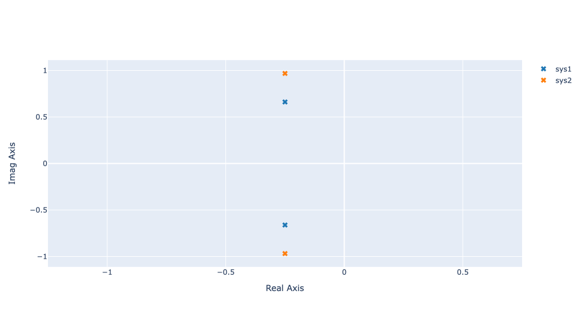
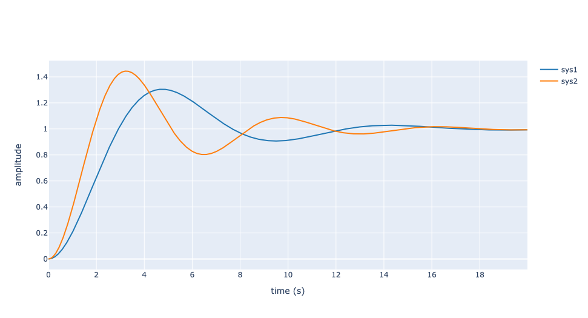
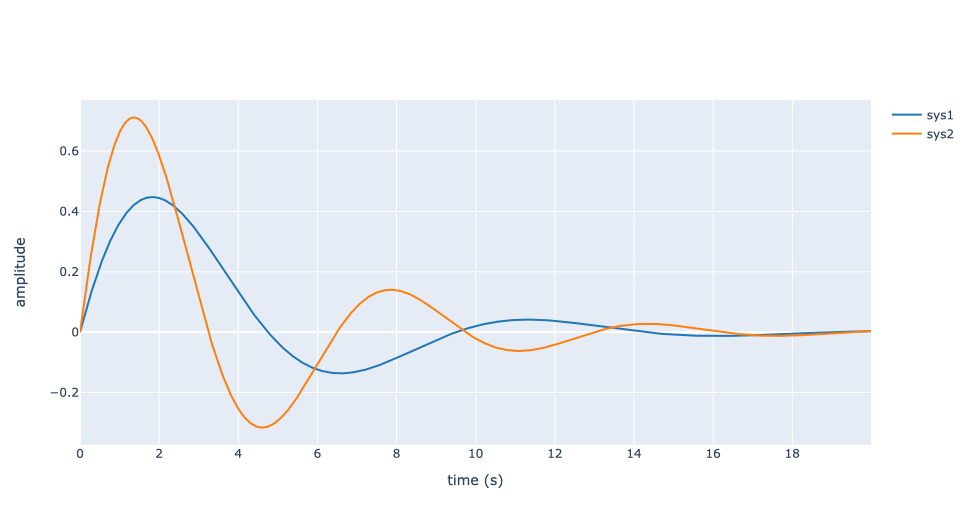
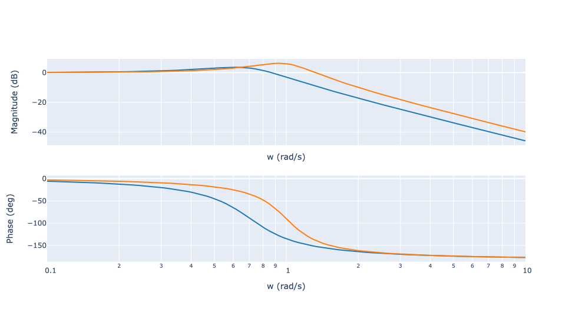
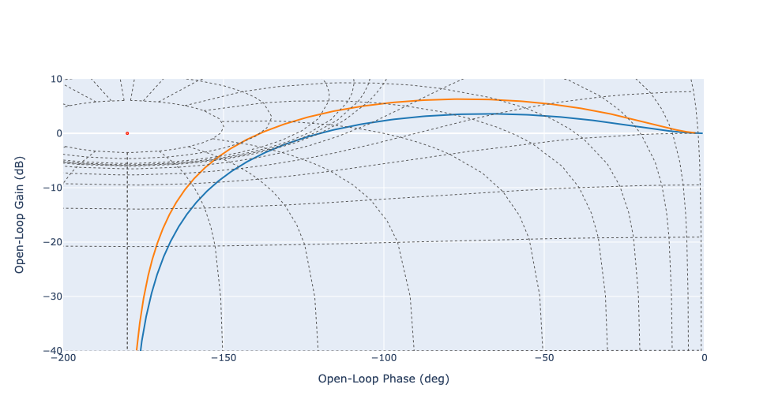
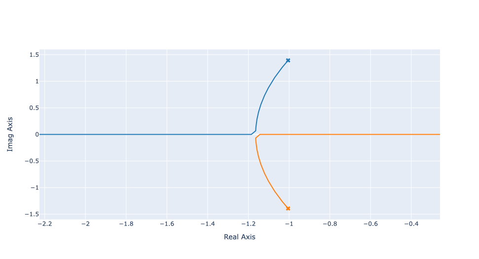

Gallery
=======

Poles and Zeros
---------------

The function :func:`control_plotly.pzmap` creates a pole-zero plot of the continuous or discrete-time system `sys`.

Step Reponse
------------

The function :func:`control_plotly.step` create a step response plot for the continuous or discrete-time system `sys`.

Impulse Reponse
---------------

The function :func:`control_plotly.impulse` create a step response plot for the continuous or discrete-time system `sys`.

Bode Plot
---------

The function :func:`control_plotly.bode` create a bode plot for the continuous or discrete-time system `sys`.

Nichols Plot
------------

The function :func:`control_plotly.nichols` create a nichols plot for the continuous or discrete-time system `sys`.

Root Locus Plot
---------------

The function :func:`control_plotly.rlocus` create a root locus plot for the continuous or discrete-time system `sys`.

