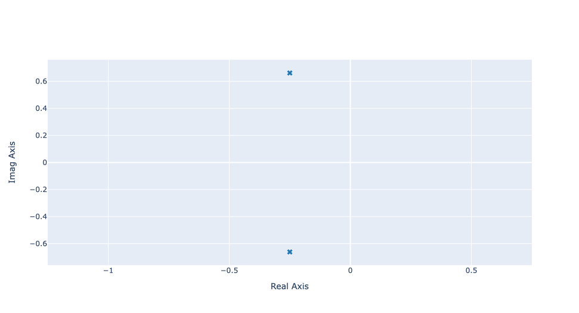

Getting Started
===============

The `python-control-plotly` library provides several classes and functions to analyse the behavior of continuous and discrete time systems.
As its name suggests, this library is based on the `python-control` and `plotly` libraries.

This librairy contains low-level and high-level API. 

* Low level API provides several classes that allows in-depth customisation of plots, 
* High level API provides several function that mimic the behavior of some Matlab plotting function. This tools relies on the low-level api.

Most of users will only use the high-level API since it allows to plot graph with a mininum of code. 

Installation
------------

.. code ::

    pip install control-plotly

How to use it 
-------------

This library requires the `python-control` library. This library can be importer as follows

.. code ::
    
    import control as ctl

There are basically two ways to use this library. 

* Standalone Python code
* Jupyter Notebook

Standalone Python code
++++++++++++++++++++++

For standalone python code, figures are plotted in your default browser. For this use case, you need to explicitely call the `show()` method to show your plot.

.. code ::
    
    from control_plotly import pzmap

    sys = ctl.tf([1],[2,1,1])
    fig = pzmap(sys)
    fig.show()

    
Jupyter Notebook
++++++++++++++++

In jupyter notebook, figures are automatically plotted if the plotting function is located in the last line of a code cell. 

.. code ::

    import control as ctl
    from control_plotly import pzmap

    sys = ctl.tf([1],[2,1,1])
    pzmap(sys)